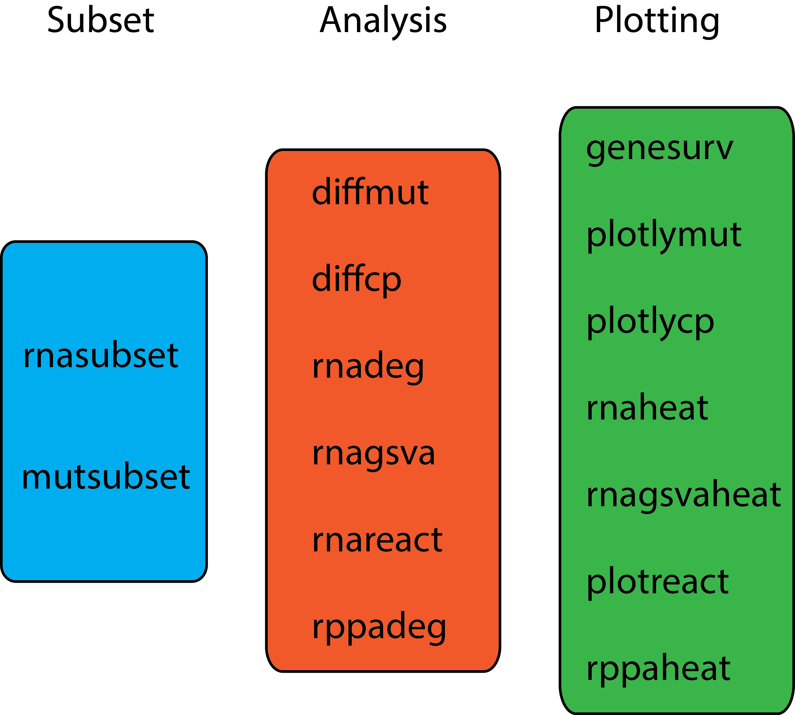

# Introduction
The Cancer Genome Atlas has provided a comprehensive omics study of 33 cancers. The National Cancer Institute (NCI) has made this data pubically available on the Genomic Data Commons [(GDC)](https://gdc-portal.nci.nih.gov/) Data Portal. There are several R packages that download the data, `r Biocpkg("RTCGAToolbox")`, `r Biocpkg("RTCGA")`, `r Biocpkg("TCGAbiolinks")`, `r CRANpkg("TCGA2STAT")`, `r Biocpkg("MultiAssayExperiment")`, and [TCGA-Assembler](http://www.compgenome.org/TCGA-Assembler/).

The motivation for TCGAbrowser was to provide convenience functions and wrappers to analyze the omics datasets by gene expression or mutation subsetting. Typically, biologists are studying one gene in one cancer by overexpression and/or knockdown experiments. TCGAbrowser was designed to subset the datasets by gene expression or gene mutation and perform differential gene expresion, mutation, copy number, protein and survival analysis. 

# Installation
To install TCGAbrowser use the code below.
```{r, message = FALSE, warning = FALSE}
require(devtools)
devtools::install_github("pcheng84/TCGAbrowser")
require(TCGAbrowser)
```

The workflow for TCGAbrowser is shown in the graphic below.

```{r, out.width = "50%", echo = FALSE}

```

TCGAbrowser functions were designed either to subset the data, perform statistical analysis or for plotting. 

Subset functions include `rnasubset` and `mutsubset` which that subset the data based on RNA expression and mutation status respectively. 

Analysis functions include: `diffmut` for differential mutation analysis; `diffcp` for differential copy number analysis; `rnadeg` for differential RNA expression analysis; `rnagsva` and `rnagsvasig` for differential GSVA analysis; `rnareact` for reactome pathway analysis on the differential RNA expression analysis; `rppadeg` for differential RPPA analysis. 

Plotting functions include: `genesurv` for Kaplan-Meier survival plots; `plotlymut` for an Oncoprint-like plot of mutation data; `plotlycp` for an Oncoprint-like plot of copy number data; `rnaheat` for a heatmap of differential expressed genes; `rnagsvaheat` for a heatmap of differential expressed pathways; `plotreact` for Reactome dotplots, enrichment plots and cnetmap plots; `rppaheat` for a heatmap of differential expressed proteins.


#Data download and formating
This vignette assumes the user will use one of the R packages mentioned above to download the TCGA data. In this example, we used `r CRANpkg("TCGA2STAT")` to download the data. (TCGA2STAT does not work on windows machines). We also used a customized function to download the RPPA data. Some processing steps are needed for the data.frames to be used in TCGAbrowser. 

```{r, message = FALSE, warning = FALSE}
require(TCGA2STAT)
#download RSEM normalized gene expression values and clinical data
rnaseq.skcm <- getTCGA(disease = "SKCM", data.type = "RNASeq2", clinical = TRUE)

#make data.table version of RNAseq data and shortens sample name
require(data.table)
rna <- data.table(Gene = rownames(rnaseq.skcm$dat), rnaseq.skcm$dat)

#renames RNAseq data
setnames(rna, sub("(TCGA-.*?-.*?-.*?)-.*", "\\1", colnames(rna)))

#reorders samples alphabetically
setcolorder(rna, order(colnames(rna)))

#download binary matrix of mutations
mut.skcm <- getTCGA(disease = "SKCM", data.type = "Mutation", type = "somatic")

#make data.table version of mutation data
mut <- data.table(Gene = rownames(mut.skcm$dat), mut.skcm$dat)

#download copy number values, remove Y chromosome genes
cnv.skcm <- getTCGA(disease = "SKCM", data.type = "CNV_SNP", filter = "Y")

#make data.table version of copy number data and sets thresholds for loss and gain at -0.2 and 0.2 respectively
cp <- data.table(Gene = rownames(cnv.skcm$dat), cnv.skcm$dat)
for (j in seq_len(ncol(cp))[-1])  {
    set(cp, which(cp[[j]] > 0.2),j,1)
    set(cp, which(cp[[j]] < -0.2),j,-1)
    set(cp, which(cp[[j]] >= -0.2 & cp[[j]] <= 0.2),j,0)
  }
  
setnames(cp, sub("(TCGA-.*?-.*?-.*?)-.*", "\\1", colnames(cp)))
setcolorder(cp, order(colnames(cp)))

#get rppa data
'%&%' <- function(a, b) paste(a, b, sep="")

getTCGA_rppa = function(disease){
  # disease = "BRCA"
  ldoc <- XML::htmlTreeParse("http://gdac.broadinstitute.org/runs/stddata__latest/", useInternalNodes = T)
  llinks = unlist(XML::xpathApply(ldoc, "//a[@href]", XML::xmlGetAttr, "href"))
  d.links = grep("/data/" %&% disease,llinks,value = T)
  ddoc = XML::htmlTreeParse(d.links, useInternalNodes = T)
  keyWord = "//a[contains(@href, 'RPPA')]"
  plinks = XML::xpathSApply(ddoc, keyWord, XML::xmlGetAttr, 'href')
  plinks = plinks[grepl("Level_3.*.gz$", plinks)]
  download.file(d.links %&% "/" %&% plinks, destfile = "temp.tar.gz")
  untar("temp.tar.gz")
  file.remove("temp.tar.gz")
  infile = sub("^(gdac.broadinstitute.org_.*).tar.gz$", "\\1", plinks) 
  #annot = fread(infile %&% "/" %&% disease %&% ".antibody_annotation.txt")
  if(file.exists(infile %&% "/" %&% disease %&% ".rppa.txt")){
    rppa = read.table(infile %&% "/" %&% disease %&% ".rppa.txt", sep="\t", head=T, stringsAsFactors = F)
    names(rppa) = gsub("\\.","-",names(rppa))
    t.ceref = t(sapply(rppa$'Composite-Element-REF', function(x) unlist(strsplit(x, "\\|")[[1]])))
    rppa$Gene = t.ceref[,1]
    rppa$CE.REF = t.ceref[,2]
    rppa = rppa[,c(ncol(rppa)-1,ncol(rppa),2:(ncol(rppa)-2))]
   } else {
    rppa = "file not found"
  } 
  unlink(infile, recursive=TRUE)
  rppa
}

rppa <- data.table(getTCGA_rppa("SKCM"))
setnames(rppa, sub("(TCGA-.*?-.*?-.*?)-.*", "\\1", colnames(rppa)))

#put survival dates into one column and convert to years
pat <- data.table(bcr_patient_barcode = rownames(rnaseq.skcm$clinical), rnaseq.skcm$clinical)
pat$days <- as.numeric(ifelse(is.na(pat$daystodeath), pat$daystolastfollowup, pat$daystodeath)) 
pat$TCGA_year <- pat$days/365.25
pat$vitalstatus <- as.numeric(pat$vitalstatus)

#adds RNAseq sample name to clinical data
samp <- data.table(name = colnames(rna), bcr_patient_barcode = sub("(TCGA-.*?-.*?)-.*", "\\1", colnames(rna)))
pat <- merge(pat, samp, by = "bcr_patient_barcode")
```

#Subset by gene expression workflow
`rnasubset` needs 4 parameters: the clinical table, the RNAseq count table, a gene and a percentage cutoff. This function will intersect the TCGA patient barcode with the sample barcodes from RNAseq. If there is more than one sample for one patient, the patient row will be duplicated in the output table. Some patients have a primary tumor and a metastatic tumor sample.

`rnasubset` will return a data.table with 5 additional columns to the original clinical table. The level column will contain the RSEM values for the gene of interest. The exprs_rank column will contain the rank of gene expression. The high column will contain TRUE values for samples that are in the upper quantile of expression. The low column will contain TRUE values for samples that are in the lower quantile of expression. The gene2 column contains low, middle, high identifiers for which gene expression group the sample belongs to.

In this example, we will compare patients in the top 20% of SOX10 expression and to the bottom 20% of SOX10 expression.

```{r}
sox10.rna <- rnasubset(pat, rna, "SOX10", 20)
```

##Expression plotting
The output table from `rnasubset` can be used for downstream analysis and plotting functions. `plotlygenelevel` and `hchartgenelevel` are wrappers for `plot_ly` from `r CRANpkg("plotly")` and `hchart` from `r CRANpkg("highcharter")` respectively. These two functions will plot the gene expression of your gene of interest across all samples with coloring for the low, middle and high groups. 

```{r}
plotlygenelevel(sox10.rna)

hchartgenelevel(sox10.rna)
```

##Survival Analysis
`genesurv` needs 2 parameters: the output table from `rnasubset` and the gene name. `genesurv` is a wrapper for `ggsurvplot` from `r CRANpkg("survminer")`. It will plot the Kaplan-Meier curves for the high gene and low gene expression groups and report the p value from the log-rank test.   

```{r}
genesurv(sox10.rna, "SOX10")
```

##Differential gene expression analysis
`rnadeg` needs 2 parameters: the output table from `rnasubset` and the RNAseq count table. `rnadeg` is a wrapper for `voom` from `r Biocpkg("limma")`. It will calculate the genes differentially expressed between the high gene and low gene expression groups.

```{r}
sox10.deg <- rnadeg(sox10.rna, rna)
head(sox10.deg)
```

`rnaheat` needs 4 parameters: the output table from `rnasubset`, the RNAseq count table, the output table from `rnadeg`, and the gene name. `rnaheat` is a wrapper for `Heatmap` from`r CRANpkg("ComplexHeatmap")`. It will plot a heatmap of the top 100 most significant differentially expressed genes, draw a colored column bar to indicate the high gene and low gene expression groups, and a colored column bar to indicate the rank of the gene of interest.  

```{r}
rnaheat(sox10.rna, rna, sox10.deg, "SOX10")
```

##GSVA pathway analysis
`rnagsva` needs 2 parameters: the output table from `rnasubset` and the RNAseq count table. `rnagsva` is a wrapper for `gsva` from `r Biocpkg("GSVA")`. It will calculate the GSVA enrichment scores for all samples using pathway from the c2BroadSets. 

`rnagsvasig` needs 2 parameters: the output table from `rnasubset` and the output table from `rnagsva`. `rnagsvasig` is a wrapper for `lmFit` from `r Biocpkg("limma")`. It will determine the significant differences in GSVA enrichment scores between the high gene and low gene expression group. 

`rnagsvaheat` needs 4 parameters: the output table from `rnasubset`, the output table from `rnagsva`, the output table from `rnagsvasig`, and the gene name. `rnagsvaheat` is a wrapper for `Heatmap` from `r CRANpkg("ComplexHeatmap")`. It will display a heatmap of the top 100 most signifcant pathways with a colored column bar to indicate the high gene and low gene expression groups.

```{r, message = FALSE, warning = FALSE}
require(GSVAdata)
data(c2BroadSets)
sox10.gsva <- rnagsva(sox10.rna, rna)
sox10.gsvasig <- rnagsvasig(sox10.rna, sox10.gsva)
head(sox10.gsvasig)
rnagsvaheat(sox10.rna, sox10.gsva, sox10.gsvasig, "SOX10")
```

##Reactome pathway analysis
`rnareact` needs 1 parameter: the output table from `rnasubset`. `rnareact` is wrapper for `enrichPathway` from `r Biocpkg("ReactomePA")`. It will calculate enriched pathways from Reactome database. 

`plotreact` needs 4 parameters: the output table from `rnareact`, the output table from `rnadeg`, the graph selection which can be 'dot', 'map', or 'cnet', and the number of pathways for plotting. `plotreact` is a wrapper for `dotplot`, `enrichMap`, and `cnetplot` from `r Biocpkg("ReactomePA")`. 

```{r}
sox10.react <- rnareact(sox10.deg)

#dotplot
plotreact(sox10.react, sox10.deg, "dot", 15)

#pathway plot
plotreact(sox10.react, sox10.deg, "map", 15)

#cnet plot
plotreact(sox10.react, sox10.deg, "cnet", 5)
```

##Differential mutation analysis
`diffmut` needs 2 parameters: the output table from `rnasubset` and the binary mutation matrix table.  It will perform a chi-squared test between the proportions of mutated and wild-type genes between the high gene and low gene expression groups. The binary mutation matrix is an over-simplification of mutation status of a gene. Here the assumption is every mutation in a gene causes the same effect. 

`plotlymut` needs 4 parameters: the output table from `rnasuset`, the binary mutation matrix table, the output table from `diffmut`, and the gene name. It will create an Oncoprint-like plot of the top 20 differentially mutated genes and your gene of interest.

```{r, warning = FALSE}
sox10.mut <- diffmut(sox10.rna, mut)
head(sox10.mut)
plotlymut(sox10.rna, mut, sox10.mut, "SOX10")
```

##Differential copy number analysis
`diffcp` needs 2 parameters: the output table from `rnasubset` and the processed copy number table with only -1, 0, and 1 levels. It will perform a chi-squared test between copy number gain and copy number neutral and another chi-squared test for copy number neutral and copy number loss. 

`plotlycp` needs 4 parameters: the output table from `rnasubset`, the processed copy number table, the output table from `diffcp`, and the gene name. It will create an Oncoprint-like plot of the top 20 genes with copy number differenes and your gene of interest.

```{r, warning = FALSE}
sox10.cp <- diffcp(sox10.rna, cp)
head(sox10.cp)
plotlycp(sox10.rna, cp, sox10.cp, "SOX10")
```


##Differential RPPA analysis
`rppaheat` needs 3 parameters: the output table from `rnasubset`, the RPPA expression table, and the gene name. `rppaheat` will draw the heatmap for all proteins.
`rppadeg` needs 2 parameters: the output table from `rnasubset` and the RPPA expression table. `rppadeg` is a wrapper for `lmFit` from `r Biocpkg("limma")`. Since not all samples with RNAseq data have corresponding RPPA data, `rppadeg` will perform the intersection and calculate the differentially expressed proteins. 

```{r}
rppaheat(sox10.rna, rppa, "SOX10")
sox10.rppa <- rppadeg(sox10.rna, rppa)
head(sox10.rppa)
```

#Subset by mutation workflow
`mutsubset` needs 4 parameters: the clinical table, the RNAseq count table, a binary mutation matrix, and a gene name. It will return a data.table with 4 additional columns to the clinical table. The gene2 column contains if the gene is WT or mutated. The level column contains the RSEM values of the gene. The exprs_rank column contains the expression rank of the gene.

In this workflow, we will use NRAS as an example since it is mutated about 30% in melanoma. First we will identify which samples are mutated from the binary mutation matrix and add a column to the clinical table using `mutsubset`.

```{r}
nras.mut <- mutsubset(pat, rna, mut, "NRAS")
```

##Expression plotting
The expression of NRAS can be plotted with `plotlygenelevel` or `hchartgenelevel` identifying the mutated and wild-type NRAS samples.

```{r}
plotlygenelevel(nras.mut)

hchartgenelevel(nras.mut)
```

## Survival Analysis
Survival analysis comparing the NRAS mutant and wild-type samples is performed with `genesurv`.

```{r}
genesurv(nras.mut, "NRAS")
```

##Differential gene expression analysis
Differentially expressed genes between the NRAS mutant and wild-type samples is determined with `rnadeg`.
```{r}
nras.deg <- rnadeg(nras.mut, rna)
head(nras.deg)
```

`rnaheat` will produce the heatmap with the top 100 differentially expressed genes between the NRAS wild-type and mutated populations

```{r}
rnaheat(nras.mut, rna, nras.deg, "NRAS")
```

##GSVA pathway analysis
The significant pathways between the NRAS wild-type and mutant populations can be determined by `rnagsva` and `rnagsvasig`, and visualized with `rnagsvaheat`.

```{r, message = FALSE, warning = FALSE}
require(GSVAdata)
data(c2BroadSets)
nras.gsva <- rnagsva(nras.mut, rna)
nras.gsvasig <- rnagsvasig(nras.mut, nras.gsva)
head(nras.gsvasig)
rnagsvaheat(nras.mut, nras.gsva, nras.gsvasig, "NRAS")
```

##Reactome pathway analysis
Reactome pathway analysis can also be performed on the NRAS wild-type and mutant populations with `rnareact`.

```{r, eval = FALSE}
nras.react <- rnareact(nras.deg)

#dotplot
plotreact(nras.react, nras.deg, "dot", 15)

#pathway plot
plotreact(nras.react, nras.deg, "map", 15)

#cnet plot
plotreact(nras.react, nras.deg, "cnet", 5)
```

##Differential mutation analysis
The mutations different between the NRAS wild-type and mutant populations can be determined with `diffmut` and visualized with `plotlymut`.

```{r, warning = FALSE}
nras.mut2 <- diffmut(nras.mut, mut)
head(nras.mut2)
plotlymut(nras.mut, mut, nras.mut2, "NRAS")
```

##Differential copy number analysis
The copy number alterations betweeh the NRAS wild-type and mutant populations can be determined with `diffcp` and visualizyed with `plotlycp`.

```{r, warning = FALSE}
nras.cp <- diffcp(nras.mut, cp)
head(nras.cp)
plotlycp(nras.mut, cp, nras.cp, "NRAS")
```


##Differential RPPA analysis
The differentially expressed proteins between the NRAS wild-type and NRAS mutant populations can be determined by `rppadeg` and visualized with `rppaheat`.

```{r}
rppaheat(nras.mut, rppa, "NRAS")
nras.rppa <- rppadeg(nras.mut, rppa)
head(nras.rppa)
```
